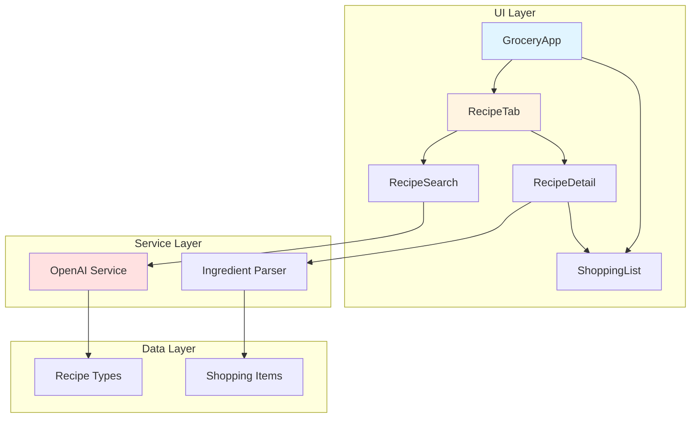
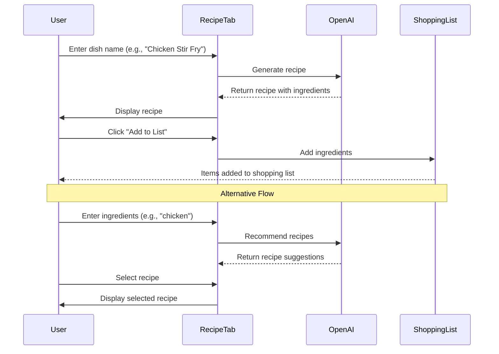

# AI-Powered Recipe Feature Implementation Plan

## Overview

Add a new Recipe tab to Grocerli that uses OpenAI API to generate recipes and extract ingredients for shopping lists.

## Architecture Diagram



## User Flow



## Implementation Steps

### 1. Install Dependencies

```bash
npm install openai
npm install @types/openai --save-dev
```

### 2. Create TypeScript Types

**File:** `src/types/recipe.ts`

```typescript
export interface Recipe {
  id: string;
  name: string;
  description: string;
  ingredients: RecipeIngredient[];
  instructions: string[];
  prepTime?: string;
  cookTime?: string;
  servings?: number;
  difficulty?: string;
}

export interface RecipeIngredient {
  name: string;
  quantity?: string;
  unit?: string;
}

export interface RecipeSearchMode {
  type: "dish" | "ingredients";
  query: string;
}

export type RecipeState =
  | "idle"
  | "searching"
  | "results"
  | "viewing"
  | "error";
```

### 3. Create OpenAI Service Module

**File:** `src/lib/openai.ts`

```typescript
import OpenAI from "openai";

// Initialize OpenAI client
const openai = new OpenAI({
  apiKey: import.meta.env.VITE_OPENAI_API_KEY,
  dangerouslyAllowBrowser: true, // Required for client-side usage
});

export interface GenerateRecipeParams {
  dishName?: string;
  ingredients?: string[];
}

export async function generateRecipeByDish(dishName: string): Promise<Recipe> {
  const response = await openai.chat.completions.create({
    model: "gpt-4o-mini",
    messages: [
      {
        role: "system",
        content: `You are a helpful cooking assistant. Generate recipes in JSON format.
        
        Response format:
        {
          "name": "Recipe Name",
          "description": "Brief description",
          "ingredients": [{"name": "item", "quantity": "amount", "unit": "unit"}],
          "instructions": ["step 1", "step 2"],
          "prepTime": "time",
          "cookTime": "time",
          "servings": number,
          "difficulty": "Easy/Medium/Hard"
        }`,
      },
      {
        role: "user",
        content: `Generate a recipe for: ${dishName}`,
      },
    ],
    response_format: { type: "json_object" },
    temperature: 0.7,
  });

  const content = response.choices[0]?.message?.content;
  if (!content) throw new Error("No recipe generated");

  return JSON.parse(content);
}

export async function recommendRecipesByIngredients(
  ingredients: string[]
): Promise<Recipe[]> {
  const response = await openai.chat.completions.create({
    model: "gpt-4o-mini",
    messages: [
      {
        role: "system",
        content: `You are a helpful cooking assistant. Suggest recipes based on ingredients.
        
        Response format:
        {
          "recipes": [
            {
              "name": "Recipe Name",
              "description": "Brief description",
              "ingredients": [{"name": "item", "quantity": "amount", "unit": "unit"}],
              "instructions": ["step 1", "step 2"],
              "prepTime": "time",
              "cookTime": "time",
              "servings": number,
              "difficulty": "Easy/Medium/Hard"
            }
          ]
        }`,
      },
      {
        role: "user",
        content: `Suggest 3 recipes using these ingredients: ${ingredients.join(
          ", "
        )}`,
      },
    ],
    response_format: { type: "json_object" },
    temperature: 0.8,
  });

  const content = response.choices[0]?.message?.content;
  if (!content) throw new Error("No recipes generated");

  const data = JSON.parse(content);
  return data.recipes || [];
}
```

### 4. Create RecipeTab Component

**File:** `src/components/RecipeTab.tsx`

```typescript
import React, { useState } from "react";
import { Input } from "./ui/input";
import { Button } from "./ui/button";
import { Card } from "./ui/card";
import { Search, ChefHat, Clock, Users, Utensils } from "lucide-react";
import {
  generateRecipeByDish,
  recommendRecipesByIngredients,
} from "@/lib/openai";
import { Recipe } from "@/types/recipe";
import { RecipeDetail } from "./RecipeDetail";
import { useToast } from "@/hooks/use-toast";

export interface RecipeTabProps {
  onAddIngredients: (ingredients: string[]) => void;
}

export const RecipeTab: React.FC<RecipeTabProps> = ({ onAddIngredients }) => {
  const [searchMode, setSearchMode] = useState<"dish" | "ingredients">("dish");
  const [searchQuery, setSearchQuery] = useState("");
  const [recipes, setRecipes] = useState<Recipe[]>([]);
  const [selectedRecipe, setSelectedRecipe] = useState<Recipe | null>(null);
  const [isLoading, setIsLoading] = useState(false);
  const [error, setError] = useState<string | null>(null);
  const { toast } = useToast();

  const handleSearch = async () => {
    if (!searchQuery.trim()) return;

    setIsLoading(true);
    setError(null);
    setRecipes([]);
    setSelectedRecipe(null);

    try {
      if (searchMode === "dish") {
        const recipe = await generateRecipeByDish(searchQuery);
        setRecipes([recipe]);
      } else {
        const ingredients = searchQuery
          .split(",")
          .map((i) => i.trim())
          .filter(Boolean);
        const results = await recommendRecipesByIngredients(ingredients);
        setRecipes(results);
      }
    } catch (err) {
      setError(
        err instanceof Error ? err.message : "Failed to generate recipes"
      );
      toast({
        title: "Error",
        description: "Could not generate recipes. Please try again.",
        variant: "destructive",
      });
    } finally {
      setIsLoading(false);
    }
  };

  const handleSelectRecipe = (recipe: Recipe) => {
    setSelectedRecipe(recipe);
  };

  const handleAddToShoppingList = (recipe: Recipe) => {
    const ingredientNames = recipe.ingredients.map((ing) => ing.name);
    onAddIngredients(ingredientNames);
    toast({
      title: "Added to List",
      description: `Added ${ingredientNames.length} ingredients to your shopping list.`,
    });
  };

  if (selectedRecipe) {
    return (
      <RecipeDetail
        recipe={selectedRecipe}
        onBack={() => setSelectedRecipe(null)}
        onAddToShoppingList={() => handleAddToShoppingList(selectedRecipe)}
      />
    );
  }

  return (
    <div className="space-y-4">
      {/* Search Mode Toggle */}
      <div className="flex gap-2">
        <Button
          variant={searchMode === "dish" ? "default" : "outline"}
          onClick={() => setSearchMode("dish")}
          className="flex-1"
        >
          <ChefHat className="w-4 h-4 mr-2" />
          Find by Dish
        </Button>
        <Button
          variant={searchMode === "ingredients" ? "default" : "outline"}
          onClick={() => setSearchMode("ingredients")}
          className="flex-1"
        >
          <Utensils className="w-4 h-4 mr-2" />
          Find by Ingredients
        </Button>
      </div>

      {/* Search Input */}
      <div className="relative">
        <Search className="absolute left-3 top-1/2 transform -translate-y-1/2 text-muted-foreground w-5 h-5" />
        <Input
          type="text"
          placeholder={
            searchMode === "dish"
              ? "Enter a dish name (e.g., Chicken Stir Fry)"
              : "Enter ingredients (e.g., chicken, rice, vegetables)"
          }
          value={searchQuery}
          onChange={(e) => setSearchQuery(e.target.value)}
          onKeyDown={(e) => {
            if (e.key === "Enter") handleSearch();
          }}
          className="pl-10 h-12 text-base"
        />
      </div>

      {/* Search Button */}
      <Button
        onClick={handleSearch}
        disabled={isLoading || !searchQuery.trim()}
        className="w-full h-12 text-base"
      >
        {isLoading ? "Generating..." : "Find Recipes"}
      </Button>

      {/* Error Display */}
      {error && (
        <Card className="p-4 border-destructive bg-destructive/10">
          <p className="text-destructive text-sm">{error}</p>
        </Card>
      )}

      {/* Recipe Results */}
      {recipes.length > 0 && (
        <div className="space-y-4">
          <h3 className="text-lg font-semibold">
            {recipes.length} Recipe{recipes.length > 1 ? "s" : ""} Found
          </h3>
          {recipes.map((recipe, index) => (
            <RecipeCard
              key={`${recipe.name}-${index}`}
              recipe={recipe}
              onSelect={() => handleSelectRecipe(recipe)}
            />
          ))}
        </div>
      )}
    </div>
  );
};

const RecipeCard: React.FC<{
  recipe: Recipe;
  onSelect: () => void;
}> = ({ recipe, onSelect }) => (
  <Card
    onClick={onSelect}
    className="p-4 cursor-pointer hover:shadow-lg transition-all border-2 hover:border-primary/50"
  >
    <div className="space-y-3">
      <h4 className="text-lg font-semibold">{recipe.name}</h4>
      <p className="text-sm text-muted-foreground line-clamp-2">
        {recipe.description}
      </p>

      <div className="flex flex-wrap gap-4 text-sm text-muted-foreground">
        {recipe.prepTime && (
          <div className="flex items-center gap-1">
            <Clock className="w-4 h-4" />
            <span>{recipe.prepTime}</span>
          </div>
        )}
        {recipe.servings && (
          <div className="flex items-center gap-1">
            <Users className="w-4 h-4" />
            <span>{recipe.servings} servings</span>
          </div>
        )}
        {recipe.difficulty && (
          <span className="px-2 py-1 bg-primary/10 text-primary rounded-full text-xs">
            {recipe.difficulty}
          </span>
        )}
      </div>

      <div className="text-sm text-muted-foreground">
        {recipe.ingredients.length} ingredients
      </div>
    </div>
  </Card>
);
```

### 5. Create RecipeDetail Component

**File:** `src/components/RecipeDetail.tsx`

```typescript
import React from "react";
import { Card } from "./ui/card";
import { Button } from "./ui/button";
import { ArrowLeft, Clock, Users, ChefHat, ShoppingCart } from "lucide-react";
import { Recipe } from "@/types/recipe";

interface RecipeDetailProps {
  recipe: Recipe;
  onBack: () => void;
  onAddToShoppingList: () => void;
}

export const RecipeDetail: React.FC<RecipeDetailProps> = ({
  recipe,
  onBack,
  onAddToShoppingList,
}) => {
  return (
    <div className="space-y-4">
      {/* Back Button */}
      <Button variant="outline" onClick={onBack} className="w-full">
        <ArrowLeft className="w-4 h-4 mr-2" />
        Back to Search
      </Button>

      {/* Recipe Header */}
      <Card className="p-6">
        <div className="space-y-4">
          <h2 className="text-2xl font-bold">{recipe.name}</h2>
          <p className="text-muted-foreground">{recipe.description}</p>

          <div className="flex flex-wrap gap-4 text-sm">
            {recipe.prepTime && (
              <div className="flex items-center gap-2 text-muted-foreground">
                <Clock className="w-5 h-5" />
                <span>Prep: {recipe.prepTime}</span>
              </div>
            )}
            {recipe.cookTime && (
              <div className="flex items-center gap-2 text-muted-foreground">
                <Clock className="w-5 h-5" />
                <span>Cook: {recipe.cookTime}</span>
              </div>
            )}
            {recipe.servings && (
              <div className="flex items-center gap-2 text-muted-foreground">
                <Users className="w-5 h-5" />
                <span>{recipe.servings} servings</span>
              </div>
            )}
            {recipe.difficulty && (
              <div className="flex items-center gap-2">
                <ChefHat className="w-5 h-5 text-primary" />
                <span className="font-medium">{recipe.difficulty}</span>
              </div>
            )}
          </div>
        </div>
      </Card>

      {/* Ingredients */}
      <Card className="p-6">
        <h3 className="text-lg font-semibold mb-4">Ingredients</h3>
        <ul className="space-y-2">
          {recipe.ingredients.map((ingredient, index) => (
            <li key={index} className="flex items-start gap-3">
              <span className="w-2 h-2 mt-2 rounded-full bg-primary flex-shrink-0" />
              <span className="flex-1">
                <span className="font-medium">{ingredient.name}</span>
                {ingredient.quantity && (
                  <span className="text-muted-foreground ml-2">
                    {ingredient.quantity}
                    {ingredient.unit && ` ${ingredient.unit}`}
                  </span>
                )}
              </span>
            </li>
          ))}
        </ul>
      </Card>

      {/* Instructions */}
      <Card className="p-6">
        <h3 className="text-lg font-semibold mb-4">Instructions</h3>
        <ol className="space-y-4">
          {recipe.instructions.map((instruction, index) => (
            <li key={index} className="flex gap-4">
              <span className="flex-shrink-0 w-8 h-8 rounded-full bg-primary text-primary-foreground flex items-center justify-center font-semibold text-sm">
                {index + 1}
              </span>
              <p className="flex-1 pt-1">{instruction}</p>
            </li>
          ))}
        </ol>
      </Card>

      {/* Add to Shopping List Button */}
      <Button
        onClick={onAddToShoppingList}
        size="lg"
        className="w-full h-14 text-base"
      >
        <ShoppingCart className="w-5 h-5 mr-2" />
        Add All Ingredients to List
      </Button>
    </div>
  );
};
```

### 6. Update GroceryApp Component

**File:** `src/components/GroceryApp.tsx`

Add Recipe tab to the existing tabs:

```typescript
import { RecipeTab } from './RecipeTab';

// Add new state for recipe ingredients
const [recipeIngredients, setRecipeIngredients] = useState<string[]>([]);

// Add handler for adding recipe ingredients
const handleAddRecipeIngredients = useCallback((ingredients: string[]) => {
  const newItems: ShoppingItem[] = ingredients
    .map(ingredient => {
      const { quantity, unit, itemName: nameWithoutQuantity } = extractQuantity(ingredient);
      const finalName = nameWithoutQuantity || ingredient;
      const bestMatch = findBestMatch(finalName);
      const displayName = bestMatch || finalName;

      return {
        id: Math.random().toString(36).substr(2, 9),
        name: displayName.charAt(0).toUpperCase() + displayName.slice(1),
        completed: false,
        quantity: quantity || undefined,
        unit: unit || undefined,
      };
    });

  setItems(prevItems => {
    const itemsToAdd = newItems.filter(newItem =>
      !prevItems.some(existing => existing.name.toLowerCase() === newItem.name.toLowerCase())
    );
    return [...prevItems, ...itemsToAdd];
  });

  // Switch to shopping list tab
  setActiveTab('make-list');
}, [extractQuantity]);

// Update TabsList to include Recipe tab
<TabsList className="grid w-full grid-cols-3 mb-4 md:mb-6 h-12 md:h-auto">
  <TabsTrigger value="make-list" className="rounded-xl min-h-[44px] md:min-h-0 text-sm md:text-base">
    Make a List
  </TabsTrigger>
  <TabsTrigger value="recipes" className="rounded-xl min-h-[44px] md:min-h-0 text-sm md:text-base">
    Recipes
  </TabsTrigger>
  <TabsTrigger value="history" className="rounded-xl min-h-[44px] md:min-h-0 text-sm md:text-base">
    History
    {history.length > 0 && (
      <span className="ml-2 px-2 py-0.5 text-xs font-medium bg-primary/10 text-primary rounded-full">
        {history.length}
      </span>
    )}
  </TabsTrigger>
</TabsList>

// Add Recipe tab content
<TabsContent value="recipes" className="mt-0">
  <div className="space-y-4">
    <div className="text-center">
      <p className="text-lg md:text-xl font-semibold text-muted-foreground">
        AI-Powered Recipes
      </p>
    </div>
    <RecipeTab onAddIngredients={handleAddRecipeIngredients} />
  </div>
</TabsContent>
```

### 7. Add Environment Variable

**File:** `.env` (create if not exists)

```env
VITE_OPENAI_API_KEY=your_openai_api_key_here
```

**File:** `.env.example`

```env
VITE_OPENAI_API_KEY=your_openai_api_key_here
```

### 8. Update .gitignore

Add `.env` to `.gitignore` to protect API key:

```
.env
.env.local
```

## Key Design Decisions

### 1. OpenAI Model Selection

- **Model:** `gpt-4o-mini` - Cost-effective, fast, good for recipe generation
- **Temperature:** 0.7-0.8 - Balanced creativity and consistency
- **Response Format:** JSON - Structured data for easy parsing

### 2. Client-Side API Calls

- Using `dangerouslyAllowBrowser: true` for simplicity
- API key stored in environment variable
- Consider implementing a backend proxy for production security

### 3. Ingredient Parsing

- Leverage existing `extractQuantity` function from GroceryApp
- Use existing `findBestMatch` for grocery database validation
- Maintain consistency with current shopping list items

### 4. UI/UX Considerations

- Two search modes: by dish name and by ingredients
- Loading states for better UX
- Error handling with toast notifications
- Responsive design matching existing app style
- Clear visual hierarchy with cards and icons

### 5. State Management

- Local component state for recipe search
- Prop drilling for ingredient addition
- Consistent with existing app patterns

## Testing Checklist

- [ ] Recipe generation by dish name works correctly
- [ ] Recipe recommendations by ingredients work correctly
- [ ] Ingredients are properly extracted and added to shopping list
- [ ] Duplicate ingredients are not added
- [ ] Loading states display correctly
- [ ] Error handling works for API failures
- [ ] UI is responsive on mobile and desktop
- [ ] Back navigation works from recipe detail
- [ ] Toast notifications display correctly
- [ ] Recipe ingredients match grocery database where possible

## Future Enhancements

1. **Recipe History:** Save favorite recipes
2. **Recipe Sharing:** Share recipes with others
3. **Nutritional Info:** Add nutritional data from AI
4. **Recipe Images:** Generate or fetch recipe images
5. **Recipe Editing:** Allow users to customize recipes
6. **Shopping List Integration:** Show which ingredients are already in list
7. **Batch Operations:** Add multiple recipes at once
8. **Recipe Filtering:** Filter by dietary restrictions, cuisine, etc.
9. **Backend API:** Implement server-side API calls for security
10. **Recipe Caching:** Cache recipes to reduce API calls
